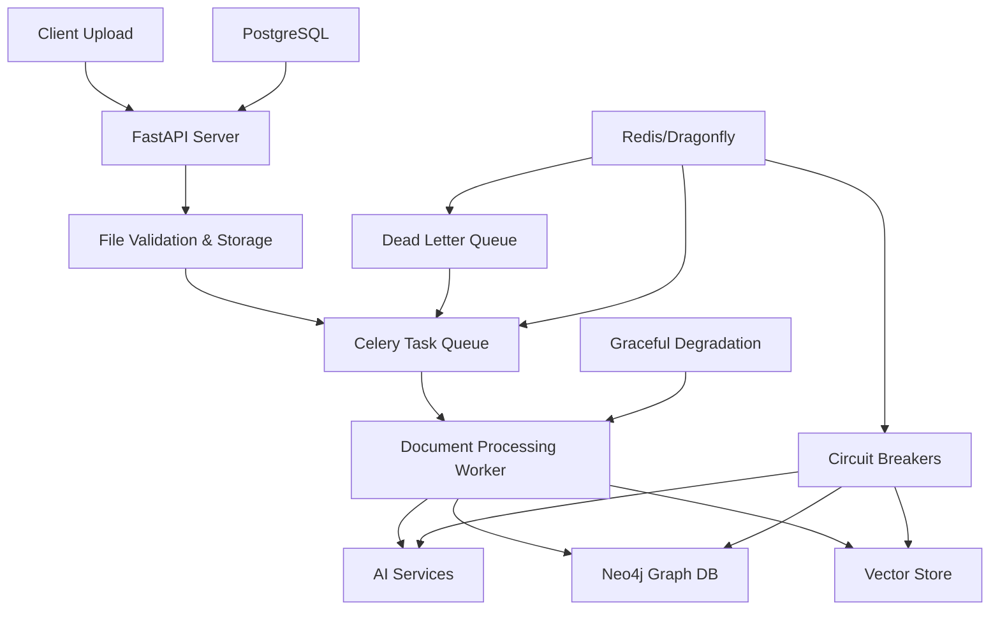

# 🧠 Graphmind

**A GraphRAG Platform for Knowledge Extraction and Retrieval**

Graphmind is a platform that combines Retrieval-Augmented Generation (RAG) with graph databases to extract, store, and query knowledge from documents. Built with production reliability in mind, it features comprehensive error handling, graceful degradation, and horizontal scaling capabilities.

## 🎯 **Overview**

Graphmind transforms unstructured documents into interconnected knowledge graphs, enabling:

- **Intelligent Document Processing**: Extract entities, relationships, and concepts from PDFs, images, and text
- **Graph-Based Knowledge Storage**: Store information in Neo4j for complex relationship queries
- **AI-Enhanced Retrieval**: Combine vector embeddings with graph traversal for superior search results
- **Production-Ready Architecture**: Built-in error handling, monitoring, and scaling capabilities
- **Modular Design**: Easily adaptable to different domains and use cases

## 🚀 **Key Features**

### 📄 **Document Processing**
- **Multi-format Support**: PDFs, images (JPEG, PNG), text files
- **Real-time Progress Tracking**: WebSocket-based upload and processing status
- **Async Processing Pipeline**: Celery-based worker system for scalable processing
- **Content Validation**: Magic number checking, size limits, and security validation

### 🔍 **Knowledge Extraction**
- **Entity Recognition**: Extract people, organizations, concepts, and custom entities
- **Relationship Mapping**: Identify and store connections between entities
- **Vector Embeddings**: Generate semantic embeddings for similarity search
- **Graph Construction**: Build comprehensive knowledge graphs automatically

### 🛡️ **Production-Ready Reliability**
- **Circuit Breaker Pattern**: Automatic service protection and recovery
- **Graceful Degradation**: Continue operating even when some services fail
- **Dead Letter Queues**: Handle failed tasks with manual retry capabilities
- **Comprehensive Monitoring**: Health checks, metrics, and error tracking

### ⚡ **Scalability & Performance**
- **Horizontal Scaling**: Multiple worker processes and load balancing
- **Database Optimization**: Connection pooling and query optimization
- **Resource Management**: Configurable limits and resource allocation

## 🏗️ **Architecture**



### **Core Components**

| Component | Technology | Purpose |
|-----------|------------|---------|
| **API Server** | FastAPI | REST API, file uploads, real-time updates |
| **Task Queue** | Celery + Redis | Async document processing |
| **Graph Database** | Neo4j | Knowledge graph storage and querying |
| **Vector Store** | Configurable | Semantic embeddings and similarity search |
| **Metadata DB** | PostgreSQL | File metadata, user data, system state |
| **Message Broker** | Redis/Dragonfly | Task queuing and pub/sub messaging |

## 🚀 **Quick Start**

### **Prerequisites**
- Docker & Docker Compose
- Python 3.13+
- 8GB+ RAM recommended

### **1. Clone & Setup**
```bash
git clone https://github.com/yourusername/graphmind.git
cd graphmind

# Copy environment template
cp .env.example .env
# Edit .env with your configuration
```

### **2. Start Services**
```bash
# Start all services with Docker Compose
cd Docker
docker-compose up -d

# Verify services are running
docker-compose ps
```

### **3. Initialize Database**
```bash
# Run database migrations
alembic upgrade head

# Verify setup
curl http://localhost:8000/health
```

### **4. Test Upload**
```bash
# Upload a test document
curl -X POST "http://localhost:8000/files/upload" \
  -H "Content-Type: multipart/form-data" \
  -F "file=@your-document.pdf"

# Or open the test interface
open upload_test.html
```

## 📋 **Configuration**

Check the `.env` file for configuration options. Key settings include:
- **Database Connections**: PostgreSQL, Neo4j, Redis
- **AI Service Keys**: OpenAI API keys
- **File Storage**: Local or S3 configuration

### **Scaling Configuration**

```env
# Worker Scaling
CELERY_CONCURRENCY=4
CELERY_PREFETCH_MULTIPLIER=1
CELERY_MAX_TASKS_PER_CHILD=1000

# Circuit Breaker Settings
CIRCUIT_BREAKER_FAILURE_THRESHOLD=5
CIRCUIT_BREAKER_RECOVERY_TIMEOUT=60
CIRCUIT_BREAKER_SUCCESS_THRESHOLD=3
```


## 📊 **Monitoring & Operations**

### **Health Monitoring**

```bash
# System health
curl http://localhost:8000/health

# Detailed service status
curl http://localhost:8000/error-handling/health

# Circuit breaker status
curl http://localhost:8000/error-handling/circuit-breakers/
```

### **Error Handling & Recovery**

```bash
# View failed tasks
curl http://localhost:8000/error-handling/failed-tasks

# Retry failed tasks
curl -X POST http://localhost:8000/error-handling/retry-tasks \
  -H "Content-Type: application/json" \
  -d '{"task_ids": ["task-id-1", "task-id-2"]}'

# Reset circuit breaker
curl -X POST http://localhost:8000/error-handling/circuit-breakers/neo4j/reset
```

## 🔒 **Security Features**

### **File Upload Security**
- ✅ **Magic Number Validation**: Binary signature verification
- ✅ **Size Limits**: Configurable per-file and total upload limits  
- ✅ **Rate Limiting**: IP-based request throttling
- ✅ **Content Scanning**: Malicious content detection
- ✅ **Extension Validation**: Whitelist-based file type checking

### **API Security**
- 🔄 **Authentication**: JWT-based auth (optional)
- 🔄 **Authorization**: Role-based access control
- ✅ **Input Validation**: Comprehensive request validation
- ✅ **Error Handling**: Secure error responses

### **Data Protection**
- 🔄 **Encryption**: At-rest and in-transit encryption
- ✅ **Audit Logging**: Comprehensive activity logging
- 🔄 **Data Retention**: Configurable data lifecycle policies

## 📈 **Performance Optimization**

### **Database Optimization**
- Connection pooling with SQLAlchemy
- Neo4j query optimization and indexing

### **Processing Optimization**
- Async processing with Celery
- Batch processing for multiple documents
- Resource-aware task scheduling

### **Scaling Strategies**
- Horizontal worker scaling
- Database read replicas
- CDN for static assets


## 🛣️ **Roadmap**


- [ ] Kubernetes deployment support
- [ ] Advanced analytics and insights
- [ ] Webhook support for integrations
- [ ] Real-time streaming processing
- [ ] Enterprise SSO integration

---
